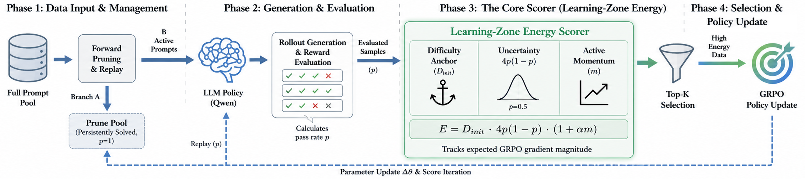

# Learning-Zone Energy: Online Data Selection for Efficient RL Post-Training

<p align="center">
  <a href="https://opensource.org/licenses/Apache-2.0">
    
  </a>
  <a href="https://arxiv.org/">
    
  </a>
  <a href="https://www.python.org/downloads/">
    
  </a>
</p>

Welcome to our repo! 🎉🎉🎉

LZE is a training-time sample selection method for reinforcement learning post-training on mathematical reasoning tasks. Its goal is simple: spend actor-update budget on prompt groups that are still teaching the model something, instead of treating every group as equally useful at every step.

This repository is a public code release for the training path itself, including reusable trainer logic, dataset loading, and runnable examples.

<p align="center">
  
</p>

## What LZE Does

LZE scores each prompt group from rollout outcomes and keeps the groups that are most likely to produce informative gradients.

In practice, the training loop has two parts:

1. Roll out multiple responses for each prompt and estimate a pass rate.
2. Convert that pass rate into a Learning-Zone Energy score and keep the highest-energy groups for actor updates.

The score favors groups that are neither already trivial nor completely hopeless, while still remembering whether a sample started out hard. This makes the retained batch track the model's current learning frontier instead of freezing a static curriculum at the start of training.

The repository also contains an optional forward pruning utility with replay. It can skip persistently solved prompts during rollout generation and periodically re-check them to guard against forgetting. The public example launchers keep the default path simple and only enable the backward LZE selector.

## What Is In This Repository

- LZE backward selection based on Learning-Zone Energy.
- GRPO-style trainer integration built on the existing verl codebase.
- Public example launchers for baseline and LZE-selected runs.
- Hugging Face dataset support for common math-reasoning datasets.
- Local smoke tests for the selection path and dataset adapter.

## Quick Start

### Installation

Please first clone the repository, then:

```bash
# Clone the repository
cd to/your/lze/path

# Create a new enviroment
conda create -n rac python=3.12 -y
conda activate lze

# Install dependencies
pip install -r requirements.txt

# Install the package in editable mode
pip install -e .
```

### Datasets

The public training path uses Hugging Face dataset sources rather than cluster-local parquet files. The dataset adapter accepts either explicit HF URLs or compact `hf://` sources and normalizes them into the internal RLHF-style schema expected by the trainer.

Common public sources used by the examples include:

- GSM8K
- MATH
- DAPO-MATH
- AMC23
- AIME-style evaluation sets

Examples of accepted dataset references:

```text
https://huggingface.co/datasets/openai/gsm8k?config=main&split=train
https://huggingface.co/datasets/EleutherAI/hendrycks_math?split=test
hf://BytedTsinghua-SIA/DAPO-Math-17k?split=train
```

If you run in an environment without outbound network access, pre-populate the Hugging Face cache ahead of time and keep the same public dataset references in your configs.

### Run Training

After installing the project in a Python environment with the required dependencies, please run one of the example launchers from the repository root.

Baseline training example:

```bash
bash examples/data_selection/run_qwen2.5_math_baseline.sh
```

LZE-selected training example:

```bash
bash examples/data_selection/run_qwen2.5_math_selection.sh
```

You can override the model, dataset URLs, or batch sizes through environment variables. For example:

```bash
MODEL_PATH=Qwen/Qwen2.5-Math-1.5B \
TRAIN_FILES="['https://huggingface.co/datasets/EleutherAI/hendrycks_math?split=train']" \
VAL_FILES="['https://huggingface.co/datasets/EleutherAI/hendrycks_math?split=test']" \
bash examples/data_selection/run_qwen2.5_math_selection.sh
```

The example scripts are deliberately small so that you can see the exact trainer flags being used and adapt them to your own cluster or launcher.

### Repository Layout

- `verl/trainer/ppo/sample_attention/`: LZE scoring, logging, and optional forward-pruning helpers.
- `verl/trainer/ppo/ray_trainer.py`: the main training path that applies LZE selection before actor updates.
- `verl/utils/dataset/rl_dataset.py`: dataset loading and Hugging Face source normalization.
- `examples/data_selection/`: minimal public launchers for baseline and LZE runs.

## Notes For Users
During the completion of this work, we had to replace the server and migrate all data. This may have caused damage to a very small number of files. Although we have conducted comprehensive experimental verification on the new server to ensure full functionality, if you find any issues with this repository, please feel free to contact us. We will provide support to help you reproduce our experimental results.🤗

